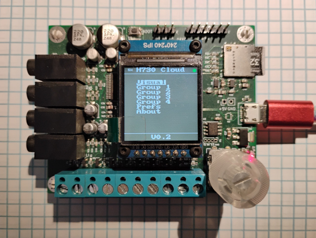

# H730-Audio

A small audio DSP board with GPIO, GUI and SD card.

## Abstract

A few years ago I was approached by my friend and colleague [Robert Rich](https://robertrich.com/) to help with a fascinating audio project that would be used to create immersive audio installations. He needed a device that would process sound in different ways - sometimes responding to sound, sometimes responding to environmental conditions. We kicked the ideas around for a while and tried various off-the-shelf solutions (Raspberry Pi, etc) but nothing was quite right so I ended up designing the H730 Audio board from scratch specifically for his requirements. The board needed audio input and output, storage, on-site configurability and the ability to use light sensors and this is what we ended up with:

- STM32H730 microcontroller - this is a compact, inexpensive and powerful device with plenty of I/O and on-chip resources that make for a capable "blank slate" on which to implement any DSP we might come up with

- WM8731 codec - I had a good stock of these in my inventory and I was very familiar with it. The device is EOL now and difficult to get, but in 2020 it was still a viable option. Today I'd probably use something like the Nuvoton NAU88C22 for equivalent features and performance.

- Micro SD-card slot - this is for storing long audio files of ambient recording and playback.

- 8 channel voltage-protected GPIO on a terminal block - for connecting sensors in environmental response installations. Specifically we used surplus solar panels to detect light changes throughout the day in order to modulate audio pitch and timbre.

- Micro USB - primarily used for 5V power, but also for USB DFU software updates.

- 240x240 IPS LCD - for user interface.

- Rotary encoder with pushbutton - for user interface.

- Quad SPI footprint for PSRAM or Flash memory - for audio sample storage or delay memory.

- 32kB I2C EEPROM - for user setting storage.

- Miscellaneous I/O headers for debug/development and "future expansion"

## Hardware

The design was created in an older version of Kicad and five boards were hand assembled - four went to Robert and several have been used in museum installations along with supporting hardware hand-built by Robert. The remaining board is in my collection. Design materials can be found in the [Hardware](./Hardware) directory.

## Firmware

Applications for this board were created in C using the STM32 HAL and ARM CMSIS libraries. Two audio installations are supported - a light-sensitive cloud generator and a day-long audio environment delay/feedback system. The source code for these applications is not provided at this time as they are proprietary, but basic hardware drivers are available in the [Firmware](./Firmware) directory.

## Documentation

The full users guide for the board with info on the I/O ports and use of the audio applications is here: [User Guide](./doc/h730_audio_info.pdf)

The board schematic is here: [Schematic](./doc/h730_audio_sch.pdf)

## Going Further

 Robert has a nice write-up on the system this board was used in over on his site that includes photos and videos:

[Sound Sculpture](https://robertrich.com/graphic-art/sound-sculpture/)
